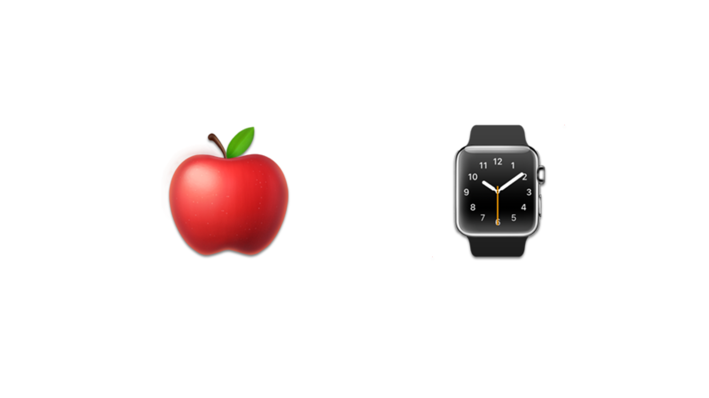

# About

Awesome Apple Watch is a curated list of awesome watchOS frameworks, libraries, sample apps, including Objective-C and Swift Projects.

> PRs are welcome! 

# How to Use

Awesome Apple Watch is an awesome list for people who need a certain feature on their Apple Watch application, so the best ways to use are:

* Simply press command + F to search for a keyword
* Go through our Content Menu

# Content

* [Getting Started](#getting-started)
* [Design Guide](#design-guide)
* [Library](#library)
    * [UI](#ui)
    * [Connectivity](#connectivity)
* [Tutorials](#tutorials)
* [Books](#books)
* [Sample Apps](#sample-apps)

## Getting Started

* [Apple Developer WatchKit Documentation](https://developer.apple.com/documentation/watchkit)

## Design Guide

* [watchOS Human Interface Guidelines](https://developer.apple.com/design/human-interface-guidelines/watchos/overview/themes/)

## Library

### UI

### Connectivity

|                           Name                           | License |                                         Demo                                         |
|:--------------------------------------------------------:|:-------:|:------------------------------------------------------------------------------------:|
| [MMWormhole](https://github.com/mutualmobile/MMWormhole) | MIT     |  |

### Plugin

#### react-native

* [React Native Watch Connectivity](https://github.com/mtford90/react-native-watch-connectivity)

#### Cordova

* [AppleWatch Cordova plugin](https://github.com/Telerik-Verified-Plugins/AppleWatch)

## Tutorials

### Youtube

* [WatchKit Tutorial](https://www.youtube.com/watch?v=MAMAqvjPWxo&list=PLveAIogCrRlX2KIm8rfytPArufhV9knnV)
* [WatchKit Swift Tutorial: Create a real world Apple Watch App](https://www.youtube.com/watch?v=sZAT8wNJnF0)
* [Make Your First Apple Watch App in 11 minutes - Tutorial [WatchKit SDK]](https://www.youtube.com/watch?v=MeGArZtbGZ8)
* [Learn How to Make a Simple Apple Watch App](https://www.youtube.com/watch?v=_l393Xm-qsU)

### Blog

* [Send data to parent iOS app](https://kristina.io/send-data-to-parent-ios-app/)
* [Building a Simple Guess Game](https://www.appcoda.com/watchkit-introduction-tutorial/)
* [How To Build Apple Watch App To Obtain Current Location](https://www.spaceotechnologies.com/build-apple-watch-app-watchkit-tutorial/)

## Books

## Sample Apps

# Other Awesome Lists

### Contributing
